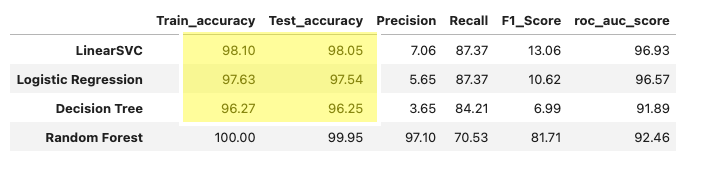
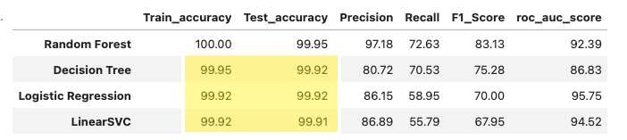

# (IN PROGRESS)💳 Credit Card Fraud Detection | Machine Learning Project

---

## 🧠 Project Overview

This project develops and compares multiple machine learning models to detect fraudulent credit card transactions. Given the extreme class imbalance typical in fraud detection datasets, the analysis explores both undersampling and oversampling strategies to balance the data and enhance model performance.

The models are evaluated using key performance metrics such as ROC-AUC, precision, recall, and F1-score, with the goal of identifying the model that best distinguishes fraudulent from legitimate transactions.

---

## 📂 Dataset Description

- **Source:** Publicly available, anonymized credit card transaction dataset.  
- **Shape:** 284,807 rows × 31 columns  
- **Target Variable:** Class 
  - `0` → Legitimate transactions  
  - `1` → Fraudulent transactions  
- **Features:**
  - `V1`–`V28`: PCA-transformed numerical features
  - `Time`, `Amount`: Non-PCA features requiring scaling  

---

## ⚙️ Data Preprocessing

### 1. Exploratory Data Analysis (EDA)
- Confirmed **no missing values**.  
- Fraudulent cases represent **~0.172%** of total records.  
- Correlation heatmaps verified orthogonality of PCA features.  
- Visualized the distribution of all variables and performed frequency analysis of fraud vs non-fraud classes

### 2. Feature Scaling
| Feature | Scaler Used | Justification |
|----------|--------------|----------------|
| `Amount` | `RobustScaler` | Handles outliers and skew |
| `Time` | `MinMax` | Scales to a fixed range [0, 1] |
| `V1–V28` | None | Already scaled via PCA |

> PCA inherently standardizes data before component extraction, so additional scaling is unnecessary.

### 3. Train–Test Split
- Split: **80% training / 20% testing**
- Stratified to preserve class proportions (for base model evaluation)
- Fixed `random_state` for reproducibility  

### 4. Handling Class Imbalance
Two rebalancing strategies were used:
- **Random Undersampling** → Downsampled the majority (non-fraud) class.  
- **SMOTE Oversampling** → Generated synthetic fraud samples to achieve a balanced dataset.  

---

## 🤖 Machine Learning Models

| Model | Sampling Strategy | Purpose |
|--------|------------------|----------|
| Logistic Regression | Base / Undersampled / Oversampled | Linear baseline |
| Decision Tree Classifier | Base / Undersampled / Oversampled | Captures nonlinear relationships |
| Random Forest Classifier | Base / Undersampled / Oversampled | Ensemble learner to reduce variance |
| Support Vector Machine (LinearSVC) | Base / Undersampled / Oversampled | Maximizes class separation margin |

---

## 📈 Evaluation Metrics
Each model was evaluated using:

- **Accuracy**
- **Precision**
- **Recall (Sensitivity)**
- **F1-Score**
- **ROC-AUC**
- **Confusion Matrix**

> 🎯 *High recall and ROC-AUC are prioritized since undetected fraud (false negatives) is more costly than false positives.*

---

## 🧩 Model Performance Summary

### ⚖️ Base (Imbalanced Data)
| Model | Train Accuracy | Test Accuracy | Precision | Recall | F1-Score | ROC-AUC |
|--------|----------------|----------------|------------|----------|----------|-----------|
| **Random Forest** | **100.00** | **99.95** | 97.18 | 72.63 | 83.13 | 0.92 |
| Decision Tree | 99.95 | 99.92 | 80.72 | 70.53 | 75.28 | 0.87 |
| Logistic Regression | 99.92 | 99.91 | 84.62 | 57.89 | 68.75 | 0.96 |
| Linear SVC | 99.92 | 99.91 | 86.89 | 55.79 | 67.95 | 0.96 |

---

### 🔽 Undersampling (Balanced Data)
| Model | Train Accuracy | Test Accuracy | Precision | Recall | F1-Score | ROC-AUC |
|--------|----------------|----------------|------------|----------|----------|-----------|
| Logistic Regression | 94.84 | 95.79 | 98.02 | 94.29 | 96.12 | **0.98** |
| Linear SVC | 94.71 | 95.26 | 98.00 | 93.33 | 95.61 | 0.98 |
| Random Forest | 100.00 | 95.26 | 98.98 | 92.38 | 95.57 | 0.98 |
| Decision Tree | 95.63 | 95.26 | 98.98 | 92.38 | 95.57 | 0.97 |

---

### 🔼 Oversampling (SMOTE – Balanced)
| Model | Train Accuracy | Test Accuracy | Precision | Recall | F1-Score | ROC-AUC |
|--------|----------------|----------------|------------|----------|----------|-----------|
| Random Forest | **100.00** | **99.99** | **99.98** | **100.00** | **99.99** | **1** |
| Logistic Regression | 94.69 | 94.73 | 97.53 | 91.82 | 94.59 | 0.99 |
| Decision Tree | 93.94 | 94.00 | 96.86 | 90.99 | 93.84 | 0.98 |
| Linear SVC | 94.21 | 94.31 | 97.98 | 90.53 | 94.11 | 0.99 |

---

## 🔑 Key Insights

Handling class imbalance dramatically improved fraud detection performance.

for our base models, while setting class_weight='balanced' can be a useful starting point for handling imbalanced datasets, it is not always sufficient, especially with highly imbalanced data or specific algorithm characteristics. When you enable class_weight='balanced', the model intentionally stops “playing it safe” by always predicting the majority (non-fraud) class. It automatically calculates weights, giving more weight to under-represented classes to help the model perform better on them. Hence,a few more non-fraud cases are misclassified - **lower precision**, but the model becomes more sensitive to fraud - **higher recall** 

---
### NB: Not shown in notebook

**Accuracy numbers where the models class is instantiatied with the ***'class_weight'*** attribute set to ***'balance'*** for unbalance data set**  

---

### NB: Shown in notebook

**Accuracy numbers where ***'class_weight'*** attribute is NOT set for unbalance data set**  

⚠️ Note: Random Forest shows glaring reistance to the ***class_weight = 'balanced'*** attribute compared to the other models. It achieved perfect accuracy scores across all tests and perfect metrics, all around, after SMOTE oversampling, but its 100% training accuracy across board suggests overfitting.

**Thoughts**: Class imbalance makes accuracy an unreliable metric for evaluating imbalanced datasets.It causes the model to develop a bias toward the majority class, resulting in deceptively high accuracy while failing to identify the critical minority class instances. In real-world scenarios, a model with 95% accuracy can still be ineffective if it consistently overlooks rare but important events — such as fraudulent transactions or disease diagnoses — where detecting the minority class is far more valuable than predicting the majority correctly.

---

After removing the **class_weight = 'balanced'** attribute, the imbalanced models appeared strong at first glance, with 99%+ accuracy, but failed to detect many fraud cases (recall ≤ 83%). This confirmed that accuracy alone is misleading in imbalanced problems.

Balancing the data through undersampling and SMOTE oversampling shifted performance toward what truly matters - identifying fraudulent activity. Recall rose above 90% across models, and ROC-AUC values approached 0.97–0.99.

When the dataset was balanced using SMOTE oversampling and Random Undersampling, the overall accuracy decreased compared to the highly imbalanced dataset.
This reduction is expected as balancing reduces the dominance of the majority (non-fraud) class, leading to a lower raw accuracy score.
However, this trade-off improved the model’s recall and ROC-AUC, meaning the balanced models became significantly better at detecting actual fraud cases.

⚠️ Again even as Random Forest scores perfect accuracy scores across all tests and perfect metrics, all around, after SMOTE oversampling, its 100% training accuracy across board suggests overfitting and requires more investigation.

📈 Final takeaway: Balancing the dataset proved essential. For production, an undersampled balanced Logistic Regression or Linear SVC offers the best mix of recall, stability, and interpretability based on this experiment even as no one model is superior, and its really all about tradeoffs. 
- Models trained on the imbalanced dataset had deceptively high accuracy but low fraud detection sensitivity.  
- Class balancing significantly improved **recall** and **AUC**, the two most critical metrics in fraud detection.

---

## 🚀 Future Work
- Implement **XGBoost** and **LightGBM** for comparative benchmarking.
- Explore **feature importance** (e.g., SHAP) to identify top predictors of fraud.
- Perform **threshold tuning** to optimize precision–recall trade-offs.
- Build a lightweight **GUI for interactive testing** (e.g., Streamlit / Gradio / Dash) that lets users input feature values (`Amount`, `Time`, `V1–V28`) and view predicted class, probability, and explanation (feature contributions) in real time.
- Investigate Random Forest inner workings.

---

📚 References
- Imbalanced-learn ([SMOTE](https://imbalanced-learn.org/stable/references/over_sampling.html))
- Credit Card Fraud Detection Dataset – [Kaggle](https://www.kaggle.com/datasets/mlg-ulb/creditcardfraud)

---

## 👤 Author
Olamide Olayinka
- 💼 [LinkedIn](https://www.linkedin.com/in/olamide-olayinka-a8222518/)
- 📊 [Portfolo](https://kodexl.github.io/olamideolayinka/)
- 📧 [Email](mailto:olamideolayinka@cmail.carleton.ca )
